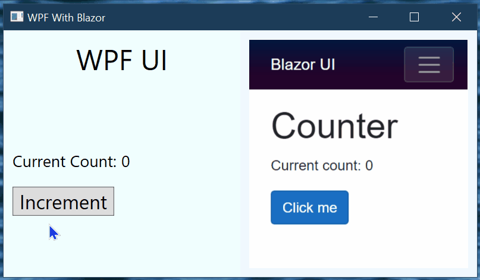

# Hosting a Blazor UI in a .NET Core WPF Application

## About

A **proof of concept** application composed of a WPF UI hosting a Blazor UI.

The application hosts ASP.net Core in the same process as WPF. This allows all of the C# code to run in the same process making the interop between the WPF and Blazor UI seamless.

## Key Aspects

* WPF Application starts and stops the ASP.NET Core application during application startup / shutdown.  The ASP.NET Core server is running in the WPF Application process.
* Blazor is running Server-side which keeps all of the .net code in the same process.
* WPF Application hosts the Blazor UI using an embedded web browser.  [CEFSharp](https://github.com/cefsharp) is used in this application to host.  CEFSharp enables a seamless hosting of the Blazor UI without any airspace issues.
* Route Parameters are used to pass a context cookie to the Blazor page.  The context cookie is then used to lookup a context object so that the Blazor page can be hooked up to the .net objects which are hosting the specific page instance.
* The application can also serve remote UIs using the same approach since everything is standard Server-side Blazor.
* The application can also provide a Web API since ASP.NET Core is used for hosting.

The Blazor portion is essentially the stock Blazor template app with a minimum number of modifications to share state with the WPF portion.

You can look at the Git history to see the steps necessary to create the app.  I tried to keep the history as "step by step" as possible.

## Open issues

* I could not find an way to make a single project both a WPF Project (Sdk="Microsoft.NET.Sdk.WindowsDesktop") and a Blazor Project (Sdk="Microsoft.NET.Sdk.Web").  This may make it harder to organized the code in a way that makes the most sense.

## Results

